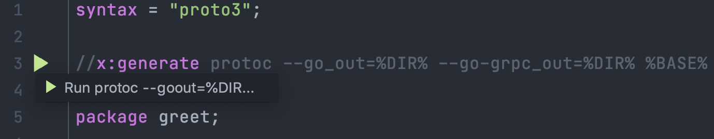
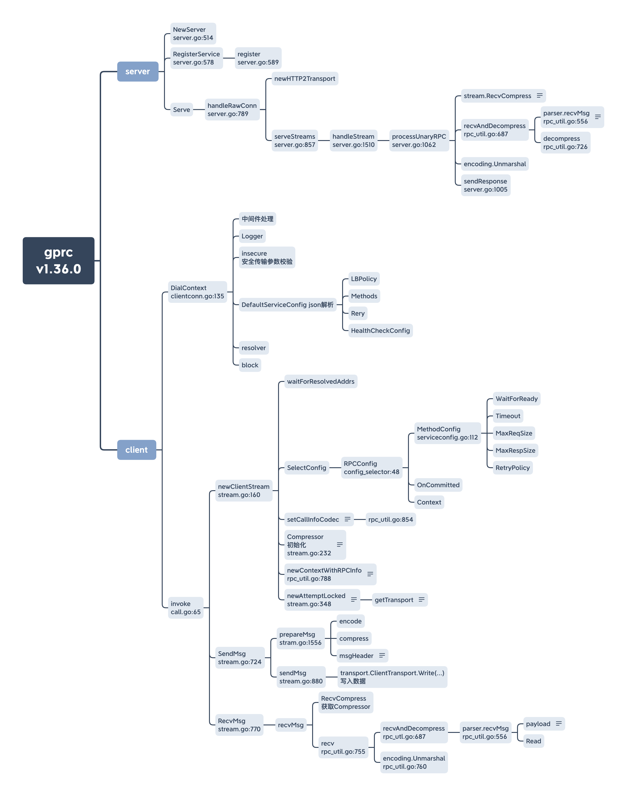

# grpc源码学习笔记(粗浅版)

本次源码阅读的目的是希望了解到grpc从client调用到server端响应的流程， 而非系统性的对每个逻辑都进行分析和详解。如果能通过本次学习到阅读grpc源码的 线索或者大致了解到其工作流程，这次阅读就有价值。

本次阅读以一元rpc使用为导向。

## 原文地址

* [grpc源码学习笔记](https://github.com/anqiansong/golang-notes/blob/main/grpc.md)

## 我的主页

* [https://github.com/anqiansong](https://github.com/anqiansong)

## 概念

### rpc

> 在分布式计算，远程过程调用（英语：Remote Procedure Call，缩写为 RPC）是一个计算机通信协议。该协议允许运行于一台计算机的程序调用另一个地址空间（通常为一个开放网络的一台计算机）的子程序，
> 而程序员就像调用本地程序一样，无需额外地为这个交互作用编程（无需关注细节）。RPC是一种服务器-客户端（Client/Server）模式，经典实现是一个通过发送请求-接受回应进行信息交互的系统。—— [维基百科](https://zh.wikipedia.org/wiki/%E9%81%A0%E7%A8%8B%E9%81%8E%E7%A8%8B%E8%AA%BF%E7%94%A8)

### grpc

grpc是google的开源rpc系统，该系统基于 HTTP/2 协议传输，使用Protocol Buffers 作为接口描述语言。

在 gRPC 中，客户机应用程序可以直接调用不同机器上的服务器应用程序上的方法，就好像它是一个本地对象一样，这使得您更容易创建分布式应用程序和服务。与许多 RPC 系统一样，gRPC 基于定义服务的思想，指定可以通过参数和返回类型远程调用的方法。在服务器端，服务器实现这个接口并运行一个 gRPC 服务器来处理客户机调用。在客户端，客户端有一个存根(在某些语言中称为客户端) ，它提供与服务器相同的方法。


## grpc 使用示例
### 1、编写proto
```protobuf
syntax = "proto3";

//x:generate protoc --go_out=%DIR% --go-grpc_out=%DIR% %BASE%

package greet;

service Greeter {
  // Sends a greeting
  rpc SayHello (HelloRequest) returns (HelloReply) {}
}

// The request message containing the user's name.
message HelloRequest {
  string name = 1;
}

// The response message containing the greetings
message HelloReply {
  string message = 1;
}
```

> 温馨提示
> 
> ```text
> //x:generate protoc --go_out=%DIR% --go-grpc_out=%DIR% %BASE%
> ```
> 这段注释在安装intellij插件(CommentShell)后可以直接运行并生成pb.go，前提是已经安装了
> `protoc` 和 `protoc-gen-go-grpc`

### 2、点击做侧边栏运行按钮生成pb.go


### 3、server端代码
```go
type serverImplemented struct {
	greet.UnimplementedGreeterServer
}

func (s *serverImplemented) SayHello(context.Context, *greet.Req) (*greet.Reply, error) {
	return &greet.Reply{}, nil
}

func main() {
	s := grpc.NewServer()
	greet.RegisterGreeterServer(s, &serverImplemented{})
	lis, err := net.Listen("tcp", "127.0.0.1:8888")
	if err != nil {
		log.Fatal(err)
	}
	err = s.Serve(lis)
	if err != nil {
		log.Fatal(err)
	}
}
```

### 4、client端代码

```go
conn, err := grpc.Dial("", grpc.WithInsecure(), grpc.WithBlock())
if err != nil {
    log.Fatal(err)
}

client := greet.NewGreeterClient(conn)
// 忽略resp
client.SayHello(context.Background(), &greet.Req{})
```

## 源码分析

### grpc版本
v.1.36.0

### 大纲


### client
我们从上面的demo的client端作为入口来进入源码，从client使用我们可以得知，
该程序有两个步骤：
* Dial
* SayHello（Invoke）

#### grpc.Dial(clientconn.go:135)

Dial最终会调用 `grpc.DialContext` 方法，这里面我个人在阅读的时候主要关注了一下几点：

* 中间件链式调用
  
  一次执行中间件中的逻辑，形成链式调用拼装
    ```go
    chainUnaryClientInterceptors(cc)
    chainStreamClientInterceptors(cc)
    ```

* insecure处理
  
  安装传输参数校验，其可以由 `grpc.WithInsecure()` 来控制是否开启安全传输，如果开启，
  则会对https证书，密钥在这一步做参数校验。
  
    ```go
    if !cc.dopts.insecure {
        if cc.dopts.copts.TransportCredentials == nil && cc.dopts.copts.CredsBundle == nil {
            return nil, errNoTransportSecurity
        }
        if cc.dopts.copts.TransportCredentials != nil && cc.dopts.copts.CredsBundle != nil {
            return nil, errTransportCredsAndBundle
        }
    } else {
        if cc.dopts.copts.TransportCredentials != nil || cc.dopts.copts.CredsBundle != nil {
            return nil, errCredentialsConflict
        }
        for _, cd := range cc.dopts.copts.PerRPCCredentials {
            if cd.RequireTransportSecurity() {
                return nil, errTransportCredentialsMissing
            }
        }
    }
    ```
* defaultServiceConfigRawJSON 解析

    通过json文本形式设置ServiceConfig，相关参数见
    ```go
    type jsonSC struct {
        // 负载均衡策略
        LoadBalancingPolicy *string
        // 负载均衡配置
        LoadBalancingConfig *internalserviceconfig.BalancerConfig
        // 每个rpc方法的配置
        MethodConfig        *[]jsonMC
        // 重试机制相关配置
        RetryThrottling     *retryThrottlingPolicy
        // 健康检测配置
        HealthCheckConfig   *healthCheckConfig
    }
    ```
* 超时控制

    客户端超时控制是通过 `Context.WithTimeout` 进行控制的，其超时时长可以通过
    `grpc.WithTimeout(time.Duration)` 控制。
  
    ```go
    if cc.dopts.timeout > 0 {
            var cancel context.CancelFunc
            ctx, cancel = context.WithTimeout(ctx, cc.dopts.timeout)
            defer cancel()
        }
    ```
* getResolver

  `getResolver`优先从DialOption中读取，其次中全局读取，DialOption可以通过 `grpc.WithResolvers()` 设置，
  全局的可以通过 `resolver.Register(Builder)` 注册,用法可参考 `resolver/dns/dns_resolver.go`。
  
    ```go
    func (cc *ClientConn) getResolver(scheme string) resolver.Builder {
        for _, rb := range cc.dopts.resolvers {
            if scheme == rb.Scheme() {
                return rb
            }
        }
        return resolver.Get(scheme)
    }
    ```
*  block控制

  在 `DialContext` 文档注释中已经说明，block会阻塞dial过程，知道连接状态变为 `Ready` 或者遇到错误，默认是非阻塞的（即在后台建立连接操作）。
  开发者可以通过 `grpc.WithBlock()` 来控制阻塞。
   
#### SayHello

通过调用 `SayHello`方法追溯，在pb.go文件中可以看到其调用了 `Invoke` 方法：
  ```go
  func (c *greeterClient) SayHello(ctx context.Context, in *Req, opts ...grpc.CallOption) (*Reply, error) {
      out := new(Reply)
      err := c.cc.Invoke(ctx, "/greet.Greeter/SayHello", in, out, opts...)
      if err != nil {
          return nil, err
      }
      return out, nil
  }
  ```

深入到 `Invoke` 方法中，找到 `ClientConn.Invoke()` 其实现了 `ClientConnInterface`，找到 `call.go` 第 29 行，在该方法中做了两件事：
```go
opts = combine(cc.dopts.callOptions, opts)

	if cc.dopts.unaryInt != nil {
		return cc.dopts.unaryInt(ctx, method, args, reply, cc, invoke, opts...)
	}
	return invoke(ctx, method, args, reply, cc, opts...)
```
* combine 组装CallOption
* invoke 真正执行client调用


##### invoke(call.go:65)

在该方法中，我们终于看到了核心的逻辑:
* newClientStream(stream.go:160)
  
  在该方法中主要是进行初始化，其中可以重点关注一下 `Compressor` 和 `Encode` 初始化。
  
  **Compressor(stream.go:233)：**
  ```go
  if ct := c.compressorType; ct != "" {
          callHdr.SendCompress = ct
          if ct != encoding.Identity {
              comp = encoding.GetCompressor(ct)
              if comp == nil {
                  return nil, status.Errorf(codes.Internal, "grpc: Compressor is not installed for requested grpc-encoding %q", ct)
              }
          }
      } else if cc.dopts.cp != nil {
          callHdr.SendCompress = cc.dopts.cp.Type()
          cp = cc.dopts.cp
      }
  ```
  `Compressor`会优先从 `CallOption` 中去读取 `Compressor` 的名称，然后从全局中去查找（前提已注册），
  其次从 `DialOption`中去读取，开发者可以通过 `grpc.WithCompressor()` 执行。
  > 自定义 `Compressor` 可参考 `gzip.go`,这也是默认的压缩方式
  
  **Encoding(rpc_util.go:854)：**
  ```go
  if c.codec != nil {
          // codec was already set by a CallOption; use it.
          return nil
      }
  
      if c.contentSubtype == "" {
          // No codec specified in CallOptions; use proto by default.
          c.codec = encoding.GetCodec(proto.Name)
          return nil
      }
  
      // c.contentSubtype is already lowercased in CallContentSubtype
      c.codec = encoding.GetCodec(c.contentSubtype)
      if c.codec == nil {
          return status.Errorf(codes.Internal, "no codec registered for content-subtype %s", c.contentSubtype)
      }
      return nil
  ```
  `Encode 会优先从 `CallOption` 中读取，然后从全局中查找，如果没有则使用默认的encoding方式—— `proto`,这个也是默认的encoding方式。
  > 自定义 `Encoding` 可参考 `proto.go`
  
* ClientStream.SendMsg(stream.go:1193)
  `SendMsg` 里面有一个比较重要的方法 `prepareMsg`，其将请求体进行encoding和compress然后得到
  `hdr`、`payload`，`hdr`中有5个byte的内容，其中第一个byte存储的是是否compress的标志位，1：压缩，
  0：未压缩。剩余4个byte存储的是payload的长度。
  在 `prepareMsg` 完成后就进入数据传输了 `transport.ClientTransport.Write`，这里就不继续深究下去了。
  
* ClientStream.RecvMsg(stream.go:1238)
  
  在 `RecvMsg` 方法中其首先通过 `transport.Stream.RecvCompress` 读取 `hdr`,判断是否需要 `UnCompress` 和 `Decoding`，然后
  通过 `recv` 读取响应的内容。

  ```go
  if !as.decompSet {
          // Block until we receive headers containing received message encoding.
          if ct := as.s.RecvCompress(); ct != "" && ct != encoding.Identity {
              if as.dc == nil || as.dc.Type() != ct {
                  // No configured decompressor, or it does not match the incoming
                  // message encoding; attempt to find a registered compressor that does.
                  as.dc = nil
                  as.decomp = encoding.GetCompressor(ct)
              }
          } else {
              // No compression is used; disable our decompressor.
              as.dc = nil
          }
          // Only initialize this state once per stream.
          as.decompSet = true
      }
      err = recv(as.p, as.codec, as.s, as.dc, m, *as.callInfo.maxReceiveMessageSize, nil, as.decomp)
      if err != nil {
          if err == io.EOF {
              if statusErr := as.s.Status().Err(); statusErr != nil {
                  return statusErr
              }
              return io.EOF // indicates successful end of stream.
          }
          return toRPCErr(err)
      }
  
  ```

## server
从上述demo中可为线索，`server`端我们关注三个阶段
* grpc.NewServer
* RegisterService
* Serve

### grpc.NewServer(server.go:514)
该方法中做的事情，我认为比 `client` 简单很多，主要是一些初始化工作，中间件的链式调用拼装也在这里完成了：
```go
chainUnaryServerInterceptors(s)
chainStreamServerInterceptors(s)
```

### RegisterService(server.go:578)
其会在做简单的 `interface` 实现检验后调用 `register(server.go:589)` 方法。
```go
s.mu.Lock()
defer s.mu.Unlock()
s.printf("RegisterService(%q)", sd.ServiceName)
if s.serve {
    logger.Fatalf("grpc: Server.RegisterService after Server.Serve for %q", sd.ServiceName)
}
if _, ok := s.services[sd.ServiceName]; ok {
    logger.Fatalf("grpc: Server.RegisterService found duplicate service registration for %q", sd.ServiceName)
}
info := &serviceInfo{
    serviceImpl: ss,
    methods:     make(map[string]*MethodDesc),
    streams:     make(map[string]*StreamDesc),
    mdata:       sd.Metadata,
}
for i := range sd.Methods {
    d := &sd.Methods[i]
    info.methods[d.MethodName] = d
}
for i := range sd.Streams {
    d := &sd.Streams[i]
    info.streams[d.StreamName] = d
}
s.services[sd.ServiceName] = info
```

本阶段将每个rpc方法进行初始化，以便后续使用。

### Serve(server.go:699)
接收来自 `client` 端的请求，为每个请求创建一个新的 `goroutine` 读取请求数据并处理后响应。
```go
for {
    rawConn, err := lis.Accept()
    if err != nil {
        if ne, ok := err.(interface {
            Temporary() bool
        }); ok && ne.Temporary() {
            if tempDelay == 0 {
                tempDelay = 5 * time.Millisecond
            } else {
                tempDelay *= 2
            }
            if max := 1 * time.Second; tempDelay > max {
                tempDelay = max
            }
            s.mu.Lock()
            s.printf("Accept error: %v; retrying in %v", err, tempDelay)
            s.mu.Unlock()
            timer := time.NewTimer(tempDelay)
            select {
            case <-timer.C:
            case <-s.quit.Done():
                timer.Stop()
                return nil
            }
            continue
        }
        s.mu.Lock()
        s.printf("done serving; Accept = %v", err)
        s.mu.Unlock()

        if s.quit.HasFired() {
            return nil
        }
        return err
    }
    tempDelay = 0
    // Start a new goroutine to deal with rawConn so we don't stall this Accept
    // loop goroutine.
    //
    // Make sure we account for the goroutine so GracefulStop doesn't nil out
    // s.conns before this conn can be added.
    s.serveWG.Add(1)
    go func() {
        s.handleRawConn(rawConn)
        s.serveWG.Done()
    }()
}
```

核心处理逻辑，我们进入 `s.handleRawConn(rawConn)` 方法查看一下，在该方法中实现了建立连接和处理 `stream`。
```go
conn, authInfo, err := s.useTransportAuthenticator(rawConn)
...
go func() {
    s.serveStreams(st)
    s.removeConn(st)
}()
```

serveStreams(server.go:857)
```go
...
s.handleStream(st, stream, s.traceInfo(st, stream))
...
```

handleStream(server.go:1510)
这里便使用到了 `RegisterService` 步骤中的部分信息，校验rpc是否存在，如果存在则继续处理，这里有一元
rpc数据处理和流式数据处理，我们进入一元rpc的数据处理 `processUnaryRPC` 
```go
srv, knownService := s.services[service]
if knownService {
    if md, ok := srv.methods[method]; ok {
        s.processUnaryRPC(t, stream, srv, md, trInfo)
        return
    }
    if sd, ok := srv.streams[method]; ok {
        s.processStreamingRPC(t, stream, srv, sd, trInfo)
        return
    }
}
```

processUnaryRPC(server.go:1062)
这里才是真正读取请求和响应请求的地方，其处理逻辑大致为
* 获取Compressor，解压读取到的payload数据
  * 1、优先从hdr中获取，如果没有则执行第2步
  * 2、从ServerOption获取是否设置Compressor
* 读取数据、UnCompress、Decode
* sendResponse响应数据


## 学习心得
* 插件式编程
  * encoding的注册与获取
  * compressor的注册与获取
  * resolver的注册与获取
* 初步了解一元rpc的调用流程

# 总结
本次学习非常粗浅，在消化后，可以进一步阅读每个阶段的细节以加深对grpc处理流程的理解和疏导。